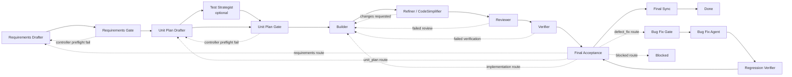

# Controller 与 Agent 交互图及贯穿性审计

本文档审计 Waygate Controller 如何把 Requirements 阶段形成的 AO、AC、Journey、设计/架构引用、基础设施、原型、测试策略、文档交付与风险假设贯穿到 Unit Plan、Builder、Refiner、Reviewer、Verifier、Final Acceptance 和 Final Sync。

范围说明：

- “第一阶段”在本文中固定指 Requirements 阶段，不等同于 `task_plan.md` 的历史阶段 1。
- 本文只记录现有交互和贯穿性结论，不修改 controller 行为。
- `.rrc-controller-*` 目录仅作为抽样审计证据；长期入口仍是 `docs/README.md`。

主要事实源：

- 正式文档：`docs/workflow.md`、`docs/architecture.md`、`docs/README.md`
- 控制器状态与路由：`workflow_controller/state_machine/actions.py`、`workflow_controller/state_machine/transitions.py`、`workflow_controller/rrc_controller.py`
- Agent prompt：`workflow_controller/prompts/requirements.py`、`workflow_controller/prompts/unit_plan.py`、`workflow_controller/prompts/builder.py`、`workflow_controller/prompts/bug_fix.py`
- 执行步骤与证据：`workflow_controller/steps/requirements.py`、`workflow_controller/steps/unit_plan.py`、`workflow_controller/steps/builder.py`、`workflow_controller/steps/final_sync.py`
- Gate 与审计：`workflow_controller/gates/validators/__init__.py`、`workflow_controller/gates/generators/__init__.py`、`workflow_controller/scope_audit.py`
- 抽样证据：`.rrc-controller-v0.6.0e/`、`.rrc-controller-v0.6.0c/`、`.rrc-controller-v0.5.6/`、`.rrc-controller-v0.6.0/`

## 1. 总览流程图

状态路由由 `compute_next_allowed_action()` 驱动。主要 action 包括 `run_requirements_drafter`、`check_requirements_acceptance`、`run_unit_plan_drafter`、`check_unit_plan_approval`、`run_builder`、`run_refiner`、`run_reviewer`、`run_verifier`、`check_final_acceptance` 和 `sync_final_acceptance_agent`。

## 2. Controller-Agent 交互清单

| # | Controller 触发条件 | Agent / 角色 | 主要输入事实源 | 输出 artifact | Controller 校验点 |
| --- | --- | --- | --- | --- | --- |
| 1 | `currentStep=REQUIREMENTS_DRAFT` | Requirements Drafter | `session.json`、`targetContextFiles`、spec metadata、Requirements Dialogue Brief、AO ledger、revision feedback | `artifacts/requirements-draft/requirements-body.md`、`requirements-draft-summary.json`、`approvals/requirements-and-acceptance.md` | 文件存在、DONE run_id、Requirements quality preflight、prototype bundle preflight |
| 2 | `WAITING_REQUIREMENTS_ACCEPTANCE` | Human / Plannotator | approval gate、可选 prototype review bundle | gate `Human Confirmation` 或 Plannotator decision | content hash、approval status、`validate_requirements_acceptance_quality()` |
| 3 | Requirements approved | Unit Plan Drafter | approved Requirements gate、state units/objectiveCoverage、AO ledger、Unit Plan revision feedback | `artifacts/unit-plan-draft/unit-plan-body.md`、`unit-plan-draft-summary.json`、`approvals/unit-plan.md` | 文件存在、draft summary、Unit Plan validation refresh |
| 4 | `testStrategistEnabled=true` | Test Strategist | Requirements gate、Unit Plan body、current unit、objective coverage | `test-strategy.json`、`test-strategy.md`、`unit-plan-gap-report.json`、`unit-plan-review-package.json` | gap report merge；critical gap 可阻断或补丁 |
| 5 | `WAITING_UNIT_PLAN_APPROVAL` | Human / Plannotator | Unit Plan gate、review package | approved Unit Plan gate | `Controller State Patch`、test strategy、AO/AC/Journey/design/prototype/document/E2E/env/golden-path validators |
| 6 | `PLAN_APPROVED` / `EXECUTE_UNIT` | Builder | approved Requirements、approved Unit Plan、current unit JSON、original prompt、previous failure feedback | `builder-summary.json`、`changed-files.txt`、runner `done.json` | runner exit、changed files、controller failure resolution contract |
| 7 | `REFINE_UNIT` | Refiner / CodeSimplifier | current unit JSON、builder summary、changed files | `simplifier-result.json`、`refinement-summary.json` | status `ok/skipped/changes_requested/failed` routing |
| 8 | `REVIEW_UNIT` | Reviewer | builder/refiner artifacts、changed files | `review.json` | missing artifact, failed builder, empty changed files, review issue routing |
| 9 | `VERIFY_UNIT` | Verifier | Unit Plan verification commands/test cases/env | `verification.json`、`green-test.txt`、journey evidence | command exit, evidence schema, real E2E policy, visual evidence policy |
| 10 | objective coverage complete | Final Acceptance Gate | verification evidence rows、scope audit、journey rows、prototype matrix、document deliverables | `approvals/final-acceptance.md`、`artifacts/final-scope-audit/*` | final gate approval, scope audit blockers, real E2E evidence, doc deliverables |
| 11 | final approved and live tmux runner exists | Final Sync Agent | `AGENTS.md`、`docs/README.md`、planning files、`session.json`、final gate | `artifacts/final-acceptance-sync/final-sync-summary.json` | sync summary status and updated file list |
| 12 | Final Acceptance defect route | Bug Fix Agent | final rejection feedback、Bug Fix Gate | `bug-fix-summary.json`、`root-cause.json`、regression `verification.json` | bug root-cause route; may return to Final Acceptance or Unit Plan |

## 3. 关键提示语摘录表

| 交互 | Prompt 来源 | 关键摘录 | 审计意义 |
| --- | --- | --- | --- |
| Requirements Drafter | `workflow_controller/prompts/requirements.py` | “Requirements approval 会被 controller 预检：每条 AC 必须声明 verification layer；每个 active must AO 必须映射到 AC...” | 将 AC layer 和 AO traceability 设为 Requirements gate 的硬契约。 |
| Requirements 基础设施 | `workflow_controller/prompts/requirements.py` | “Requirements Gate 必须输出固定审阅段落 `## 4.9 目标项目基础设施信息`。” | 4.9 不再是可选背景，而是目标项目 intake 的固定输入面。 |
| Requirements 原型 | `workflow_controller/prompts/requirements.py` | “原型是后续 Unit Plan、Verifier 和 Final Acceptance 的 UI 合约...” | 把 prototype manifest 从 review artifact 提升为生产 UI 一致性合同。 |
| Requirements UI skill | `workflow_controller/prompts/requirements.py` | “UI/原型设计约束：凡涉及 UI、Web、可点击原型...必须显式使用 `ui-ux-pro-max` skill。” | 防止 UI/prototype 工作只停留在泛视觉探索。 |
| Unit Plan Drafter | `workflow_controller/prompts/unit_plan.py` | “Document Deliverables Matrix 约束...” | 长期产品/架构/流程/运维事实变更必须显式声明 docs 动作。 |
| Unit Plan E2E | `workflow_controller/prompts/unit_plan.py` | “真实 E2E 测试必须写 `entrypoint` 或 `real_entrypoint`...” | 避免 mock-only/browser smoke test 被当成真实验收证据。 |
| Test Strategist | `workflow_controller/prompts/unit_plan.py` | “Reject static-only strategy coverage by reporting a Critical gap.” | 让测试策略独立检查 AC 是否只有静态检查或弱断言。 |
| Builder | `workflow_controller/prompts/builder.py` | “Use the approved human gate documents as the source of truth. Do not expand scope beyond them.” | Builder 只执行当前 unit，不重写需求或计划边界。 |
| Builder 文档动作 | `workflow_controller/prompts/builder.py` | “读取 Unit Plan Document Deliverables Matrix；`Required For Acceptance = true` 的文档动作必须...落到对应 `docs/*` 或登记入口。” | 让 docs deliverable 从 Unit Plan 贯穿到执行。 |
| Controller failure retry | `workflow_controller/prompts/builder.py` | “First action: run the exact failed command above from the controller cwd.” | Verifier 失败后，Builder 返工必须先复现 controller 失败命令。 |
| Refiner | `workflow_controller/steps/builder.py` | “Preserve behavior exactly. Improve clarity, consistency, and maintainability only.” | Refiner 被限制为行为保持型精修，不扩大需求范围。 |
| Bug Fix Agent | `workflow_controller/prompts/bug_fix.py` | “Do not add, remove, weaken, or reinterpret approved requirements or acceptance criteria.” | Final Acceptance defect fix 不允许绕过 Requirements change route。 |
| Final Sync | `workflow_controller/steps/final_sync.py` | “This is a status synchronization task, not an implementation task.” | 终验批准后的 agent 工作只同步状态文档，不做实现变更。 |

Reviewer 和 Verifier 当前主要是 controller-side interaction：Reviewer 读取 Builder/Refiner artifacts 并写 `review.json`；Verifier 执行 Unit Plan 命令并写 `verification.json`。它们不是自由对话 prompt，但仍是 Controller-Agent 工作流中的证据生产节点。

## 4. Requirements 到 Final Acceptance 的贯穿矩阵

状态定义：

- `Strong`：有明确结构字段、prompt 约束、controller validator 和 Final Acceptance 展示或阻断。
- `Partial`：进入后续 prompt 或某些 validator，但没有完整结构化闭环或最终矩阵可见性。
- `Missing`：当前源码没有稳定承载点。
- `Not Applicable`：仅在特定项目类型触发。

| Requirements 内容 | Requirements Gate | Unit Plan | Builder / Refiner / Reviewer | Verifier | Final Acceptance | 结论 |
| --- | --- | --- | --- | --- | --- | --- |
| Acceptance Obligation (AO) | AO ledger 和 Requirements Traceability Matrix；active must 必须 covered/deferred/rejected/out_of_scope | `test_cases[].covers_obligations` 和 Unit Plan AO coverage validator | Builder 收到 approved Requirements + Unit Plan；Reviewer 检查 artifacts | `evidence_rows[].acceptance_obligations` | Evidence Matrix 与 Final Scope Audit AO coverage | Strong |
| Acceptance Criteria (AC) | 每条 AC 必须有 stable id 和 verification layer | Test Case Matrix；`test_cases[].acceptance_criterion`；static-only 等被拒绝 | Builder 以 AC-mapped tests 为主目标 | `evidence_rows[].acceptance_criterion` 和 command status | Evidence Matrix、scope audit AC coverage、golden path | Strong |
| Journey | `## 4.7 Journey Acceptance Matrix` | closure/E2E case 必须在 `test_cases[]` 写 `covers_journeys` | Builder 收到 journey/test case 映射 | `journey_evidence_rows` | Journey Matrix 和 scope audit journey coverage | Strong for closure; N/A when no Journey |
| Product Design Ref | `## 4.5` 每条 covered AC 必须映射 Product Design Ref | test case 要保留 `product_design_refs` | Builder 收到 Requirements/Unit Plan 全文 | 当前 evidence rows 不包含该字段 | 当前 Final Evidence Matrix 不展示该字段 | Partial |
| Technical Architecture Ref | `## 4.5` 每条 covered AC 必须映射 Technical Architecture Ref | test case 要保留 `technical_architecture_refs` | Builder 收到 Requirements/Unit Plan 全文 | 当前 evidence rows 不包含该字段 | 当前 Final Evidence Matrix 不展示该字段 | Partial |
| `## 4.8` 澄清、假设与风险 | Requirements prompt 要求记录问题、回答、核对方式、结论、残余风险 | 可被 Unit Plan 文本消费，但无专门结构字段 | Builder 收到 approved Requirements 全文 | 只有映射成 test case 或 evidence 时才结构化 | 无独立 Assumption/Risk Closure Matrix | Partial |
| `## 4.9` 基础设施信息 | 固定 7 类；validator 拒绝缺失、占位、无 4.8 支撑的“用户确认/已验证” | Unit Plan 可将 infra 转成 verification_env、setup、docs deliverables | Builder 使用这些事实执行/排障 | 通过 test case/env/command 间接证明 | 无独立 Infrastructure Coverage Matrix | Partial |
| Prototype manifest / UI contract | Requirements preflight 要 manifest、implementation_targets、surface_contracts、无敏感 URL | prototype conformance test cases 必须绑定 prototype/surface/production target | Builder 必须从真实 production entrypoint 验证 | `visual_evidence_refs`、screenshot markers、runtime errors | Prototype Conformance Matrix + Visual Prototype Evidence | Strong when applicable; N/A otherwise |
| Test Strategy | AC layer、fixture/command/evidence 预期；Requirements prompt 要 `test-strategy` skill | Test Case Matrix、Test Strategist artifacts、golden path、real E2E validators | Builder 先创建或更新 command 指向测试文件 | command results + evidence rows | Evidence Matrix + Golden Path section | Strong |
| Document Deliverables | 4.9 文档地址和长期 docs 边界 | Document Deliverables Matrix | Builder 必须完成 required docs action | 间接通过 tests/manual evidence | Document Deliverables Status 阻断 required missing | Strong |
| Security / secret handling | Requirements 约束不得泄露 token/DB URL | Unit Plan 可声明 secret-safe tests | Builder/refiner runner metadata redaction | evidence rows/artifacts不应包含 secret value | scope/security manual evidence 可记录 | Partial |
| Roadmap / version boundary | Requirements 应分离当前版本与后续 backlog | Unit Plan non-goals 和 objectiveCoverage | Builder prompt 约束不扩展 scope | tests 可验证 version docs | scope audit changed files + manual review | Partial |
| Independent Requirements-stage Test Strategist | Requirements prompt 调用 `test-strategy` skill，但独立 runner 当前在 Unit Plan 阶段 | Test Strategist 可选运行于 Unit Plan draft | 不适用 | 不适用 | 不适用 | Missing as independent Requirements-stage agent; roadmap V0.6.2 已列计划 |

## 5. 未贯穿或弱贯穿清单

1. 设计/架构引用没有进入 Verifier evidence schema 和 Final Acceptance Evidence Matrix。  
   现状是 Requirements 和 Unit Plan 会强制保留引用，Builder 也能读取全文，但最终验收矩阵主要展示 AO、AC、Test Case、Layer、Environment、Evidence 和 Status。

2. `## 4.8` 假设、澄清和风险没有独立闭环矩阵。  
   infra claim 会被 validator 局部检查，但普通假设或残余风险只有在被转换成 AC/test/doc deliverable 后才会被最终证据显式证明。

3. `## 4.9` 基础设施事实缺少 Final Acceptance 专门展示。  
   4.9 的强制性主要发生在 Requirements preflight；后续通过 verification_env、test setup、docs deliverables、manual evidence 间接贯穿。

4. Requirements 阶段还没有独立 Test Strategist runner。  
   Requirements prompt 要求使用 `test-strategy` skill，但真正的独立 Test Strategist artifacts 目前挂在 Unit Plan draft 阶段；ROADMAP 已把 Requirements-stage Test Strategist 放到 V0.6.2。

5. 历史 state-dir artifact 格式随版本演进。  
   例如 `.rrc-controller-v0.6.0e/approvals/final-acceptance.md` 的 evidence matrix 比当前 generator 少 Environment、Runtime Errors 等列；审计历史 artifact 时应同时读取当前源码和 artifact 生成时间。

## 6. 改进建议

| 优先级 | 建议 | 理由 |
| --- | --- | --- |
| P1 | 在 `verification.json` evidence rows 中加入 `product_design_refs` 和 `technical_architecture_refs`，并在 Final Acceptance Matrix 展示 | 关闭 Requirements `## 4.5` 到最终验收的可见性缺口。 |
| P1 | 增加 Assumption / Risk Closure Matrix，从 Requirements `## 4.8` 提取需要关闭的假设和风险 | 避免澄清和风险只作为 prose 留存，无法在终验时逐项审阅。 |
| P2 | 增加 Infrastructure Coverage Matrix，至少展示 4.9 七类事实如何落到 test case、verification_env、docs 或 manual evidence | 把基础设施 intake 从 Requirements-only gate 扩展成最终验收可读证据。 |
| P2 | 将 prompt source registry 固化到正式 docs，并在重大流程变更时同步更新 | 本文首次把 prompt 文件与交互节点集中登记，后续可减少分散追踪成本。 |
| P3 | 按 ROADMAP V0.6.2 将独立 Test Strategist 前移到 Requirements 阶段 | 让 AC 可测性在 Requirements approval 前得到独立审阅。 |

## 7. Prompt 来源附录

| 角色 / 阶段 | 源文件或 artifact | 说明 |
| --- | --- | --- |
| Requirements Drafter | `workflow_controller/prompts/requirements.py` | Requirements body 结构、4.8/4.9、AO/AC、Journey、design/architecture、prototype、UI skill policy。 |
| Requirements runtime | `workflow_controller/steps/requirements.py` | 生成 prompt、运行 agent、恢复 pending Requirements draft、写 gate 和 summary。 |
| Requirements gate | `workflow_controller/gates/validators/__init__.py` | `validate_requirements_acceptance_quality()` 负责 AC layer、AO mapping、design/architecture、prototype、4.9 preflight。 |
| Unit Plan Drafter | `workflow_controller/prompts/unit_plan.py` | Test Case Matrix、Document Deliverables Matrix、Controller State Patch、E2E/prototype/real evidence contract。 |
| Test Strategist | `workflow_controller/prompts/unit_plan.py` | `_render_test_strategist_prompt()` 与 patch prompt 生成 strategy/gap/review package。 |
| Unit Plan runtime | `workflow_controller/steps/unit_plan.py` | Planner runner、Test Strategist runner、review package merge、Unit Plan summary。 |
| Builder | `workflow_controller/prompts/builder.py` | Approved gates as source of truth、test-first、docs deliverables、UI/prototype、failed command reproduction。 |
| Refiner | `workflow_controller/steps/builder.py` | `_render_code_simplifier_prompt()` 限定行为保持型清理，输出 `simplifier-result.json`。 |
| Reviewer | `workflow_controller/steps/builder.py` | `run_reviewer()` 读取 artifacts 并输出 `review.json`；当前是 controller-side heuristic。 |
| Verifier | `workflow_controller/steps/builder.py`、`workflow_controller/rrc_real_runtime.py` | 执行 Unit Plan commands，生成 evidence rows、journey evidence 和 visual evidence refs。 |
| Final Acceptance | `workflow_controller/gates/generators/__init__.py` | Evidence Matrix、Document Deliverables Status、Prototype Conformance Matrix、Scope Audit、Journey Matrix、Rejection Routing。 |
| Final Scope Audit | `workflow_controller/scope_audit.py` | 汇总 AO/AC/Journey coverage、changed files 和 blockers。 |
| Final Sync | `workflow_controller/steps/final_sync.py` | 终验通过后的状态文档同步 prompt 和 summary contract。 |
| Bug Fix | `workflow_controller/prompts/bug_fix.py` | 最终验收 defect route 的 root cause、regression、escalate_unit_plan contract。 |

抽样 artifact 证明交互链真实落盘：

- `.rrc-controller-v0.6.0e/events.jsonl` 记录 `requirements_draft_generated`、`requirements_acceptance_approved`、`unit_plan_draft_generated`、`unit_plan_approved`、`final_acceptance_approved`、`final_acceptance_agent_synced`。
- `.rrc-controller-v0.6.0e/approvals/requirements-and-acceptance.md` 包含 AO/AC、4.5、4.7、4.8、4.9。
- `.rrc-controller-v0.6.0e/approvals/unit-plan.md` 包含 Test Case Matrix 和 Controller State Patch。
- `.rrc-controller-v0.6.0e/artifacts/target-v0-6-0e/verification.json` 包含 `evidence_rows` 和 `journey_evidence_rows`。
- `.rrc-controller-v0.6.0e/approvals/final-acceptance.md` 展示 Final Acceptance Evidence Matrix、Final Scope Audit、Journey Matrix 和 Rejection Routing。
